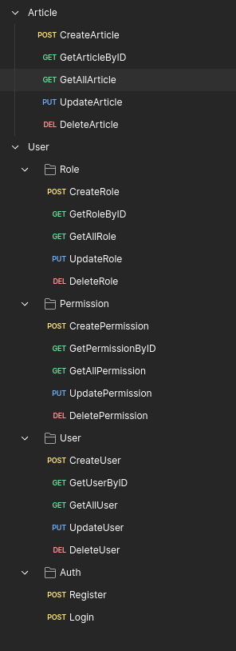

# MentEdu

## Tim
Nama Tim: Ketupat Team
Hacker: Rahman Hakim

### Api Collection


## How to run
### 1. Install dependencies
```bash
go mod download
go get -tags 'postgres' -u github.com/golang-migrate/migrate/v4/cmd/migrate
```

### 2. Run migrations
```bash
make migrate_up DATABASE_URL=<database_url>
```

### 3. Setup
```bash
make setup
```

### 4. Generate Keys
```bash
make generate-keys
```

### 5. Build
```bash
make compile-server
```

### 6. Run
```bash
./bin/server/main
```